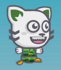
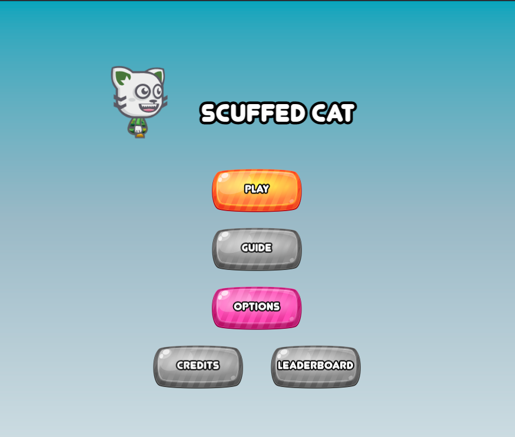
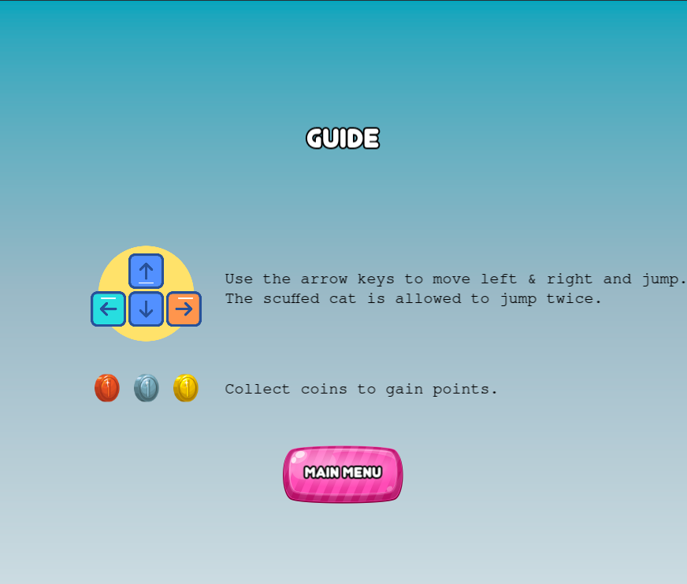
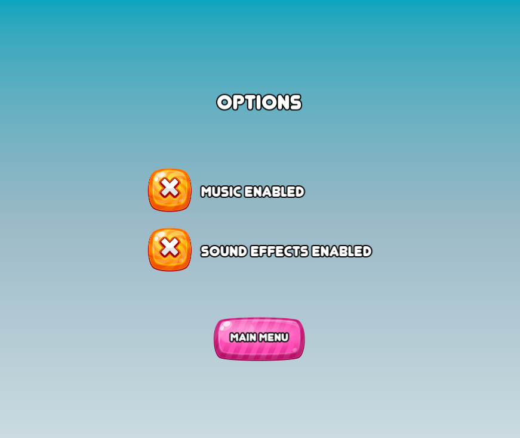
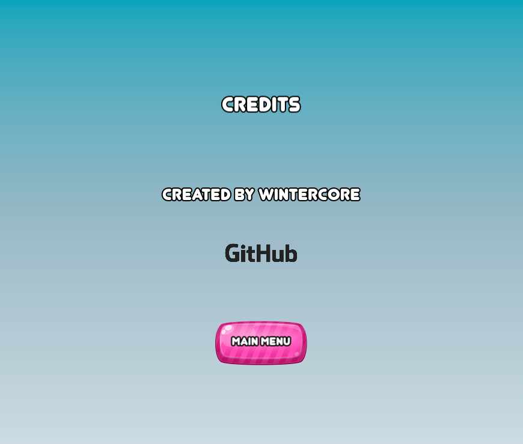
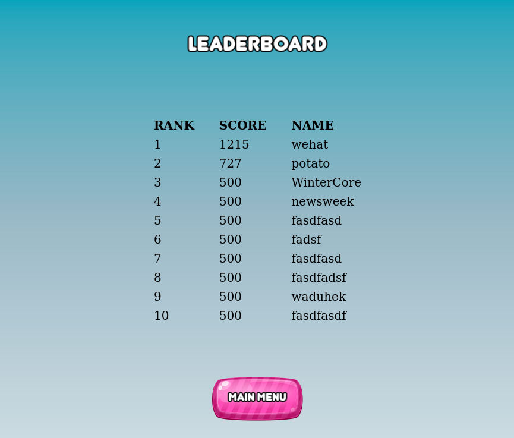
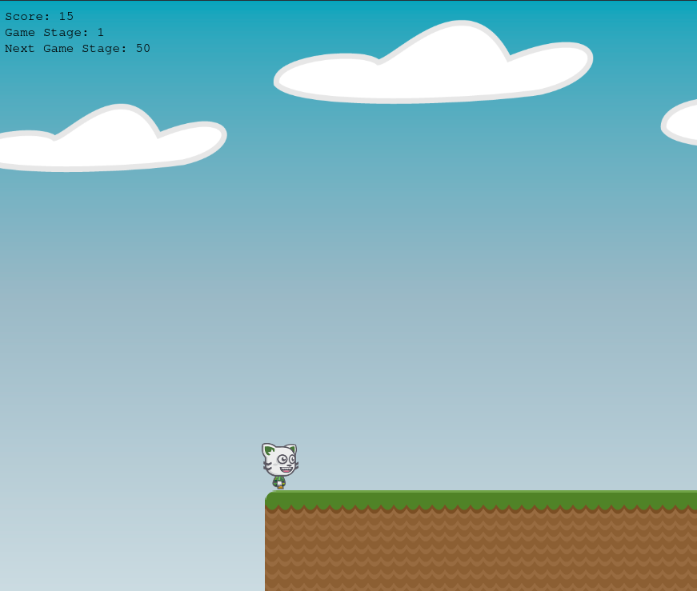
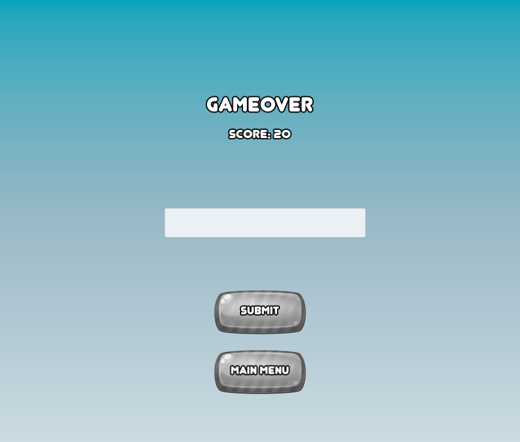

# Scuffed Cat Game Design Document
## Table of Contents
- [Scuffed Cat Game Design Document](#scuffed-cat-game-design-document)
  - [Table of Contents](#table-of-contents)
  - [Game Concept](#game-concept)
  - [Basic Gameplay](#basic-gameplay)
  - [How to Play](#how-to-play)
  - [Assets](#assets)
    - [Scuffed Cat (The main character)](#scuffed-cat-the-main-character)
    - [Coins](#coins)
    - [Platforms](#platforms)
  - [Scenes](#scenes)
    - [Main Menu](#main-menu)
    - [Guide](#guide)
    - [Options](#options)
    - [Credits](#credits)
    - [Leaderboard](#leaderboard)
    - [Gameplay](#gameplay)
    - [Gameover](#gameover)

## Game Concept

Scuffed cat is a platformer. In this game scuffed cat can jump over platforms and collect coins to achieve high scores.

## Basic Gameplay

- Players can get points by passing platforms and collecting coins.
- Game stage increases the more points you collect.
- Game stage affects the speed of the scrolling.

## How to Play

Use the left & right arrow keys to move left & right, and use the up arrow key to jump.
The player is allowed to jump twice.
Try to score as many points as possible without dying.

## Assets

### Scuffed Cat (The main character)

### Coins

- Bronze coins (left) are worth 10 points.
- Silver coins (middle) are worth 20 points. 
- Gold coins (right) are worth 35 points.

### Platforms

## Scenes

### Main Menu
> The main menu has buttons to access all the other scenes.

### Guide
> This scene contains instructions on how to play the game.

### Options
> This scene contains the game options, it has buttons to disable sound effects and background music.

### Credits
> A simple credits scene.

### Leaderboard
> This scene contains the top 10 score submissions.

### Gameplay
> Main gameplay scene where the player has to jump over platforms and collect coins to gain points, and try to avoid the holes between the platforms.

### Gameover
> The player is taken to this scene after dying so they can submit their score if they want to.

